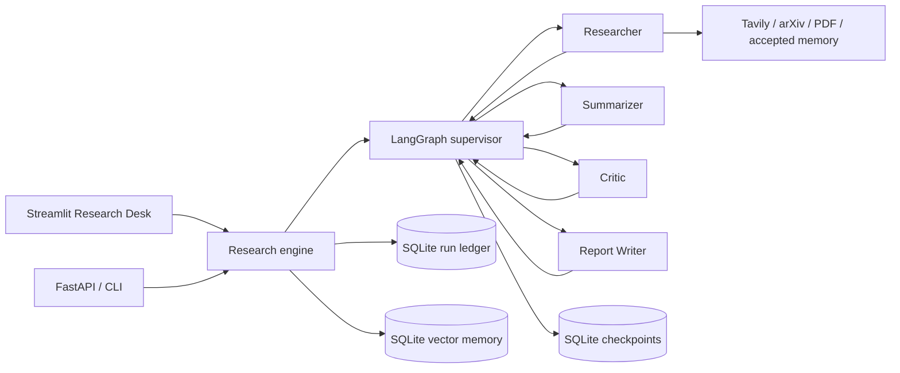

# Architecture

Research Desk keeps provider clients outside checkpointed graph state. The
graph carries only JSON-serializable request, evidence, synthesis, critique,
report, trace, warning, and conversation records.

## Supervisor contract

The custom `StateGraph` routes `researcher -> summarizer -> critic -> writer`.
The critic may request a bounded research or summary revision; code-enforced
budgets prevent infinite loops. The supervisor routes work but never writes
report content.

## Evidence contract

Every source receives a stable `S1`-style identifier, canonical URL, content
hash, provider, retrieval date, and integrity label. Uploaded and retrieved text
is untrusted evidence: it can influence synthesis, critique, revision routing,
and follow-up queries, but it cannot directly execute code or choose arbitrary
tool endpoints. The writer can cite only registered identifiers, and post-generation
validation rejects unknown citations before persistence or export.

## Memory contract

SQLite graph checkpoints provide durable same-thread continuity and state readback;
the current engine does not expose crash-resume or stale-run reconciliation. A
separate SQLite-backed vector store automatically retains only warning-free reports
approved by the model critic, using deterministic, versioned local embeddings and
in-process cosine ranking. Its schema records the embedding name and dimensions so
incompatible indexes fail closed. Recalled memory is a lead labeled
`accepted_memory`; that label means critic-approved, not human-approved, and it does
not masquerade as newly retrieved evidence.

## External references

- [LangGraph graph API](https://docs.langchain.com/oss/python/langgraph/graph-api)
- [LangGraph persistence](https://docs.langchain.com/oss/python/langgraph/persistence)
- [LangChain custom multi-agent workflows](https://docs.langchain.com/oss/python/langchain/multi-agent/custom-workflow)
- [Tavily Python SDK](https://docs.tavily.com/sdk/python/reference)
- [arXiv API](https://info.arxiv.org/help/api/index.html)
- [Python SQLite interface](https://docs.python.org/3/library/sqlite3.html)
